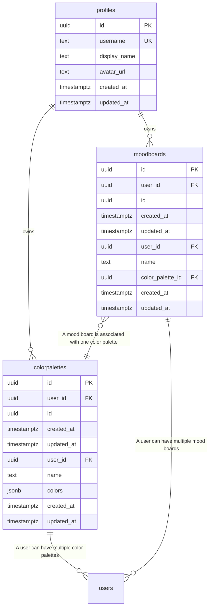

# Entity Relationship Diagram - ChromaPro

> **Auto-generated** from your idea analysis
> **Entities:** 2

---

## Visual Diagram

---

## Entity Details

### ColorPalette
> A generated color palette

**Fields:**
  - `id`: uuid (required) - Primary key
  - `created_at`: datetime (required) - Creation timestamp
  - `updated_at`: datetime (required) - Last update timestamp
  - `user_id`: uuid (required) - Owner user ID
  - `name`: string (required) - Name of the color palette
  - `colors`: json (required) - Array of colors in the palette

**Relationships:**
  - one_to_many → **User**: A user can have multiple color palettes

### MoodBoard
> A mood board created by a user

**Fields:**
  - `id`: uuid (required) - Primary key
  - `created_at`: datetime (required) - Creation timestamp
  - `updated_at`: datetime (required) - Last update timestamp
  - `user_id`: uuid (required) - Owner user ID
  - `name`: string (required) - Name of the mood board
  - `color_palette_id`: uuid (required, indexed) - Foreign key referencing the ColorPalette entity

**Relationships:**
  - one_to_many → **User**: A user can have multiple mood boards
  - many_to_one → **ColorPalette**: A mood board is associated with one color palette

---

## Notes

- All entities have standard fields: `id`, `user_id`, `created_at`, `updated_at`
- `PK` = Primary Key, `FK` = Foreign Key, `UK` = Unique Key
- Copy the Mermaid code block to visualize in any Mermaid-compatible tool
- Relationships: `||--o{` = one-to-many, `||--||` = one-to-one, `}o--o{` = many-to-many
